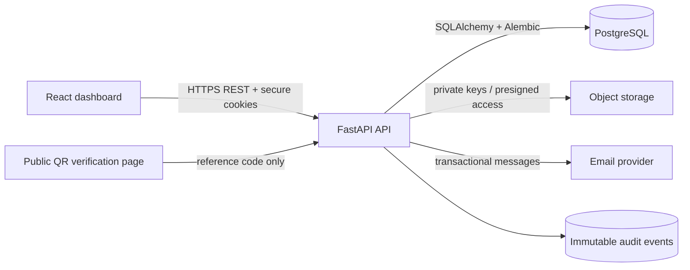

# SecureDocs Architecture Overview

SecureDocs uses a browser-facing React dashboard, a versioned FastAPI REST API, PostgreSQL for normalized relational data, and private object storage for document bytes. This separation keeps authorization and security decisions in the API rather than in the browser, while allowing the dashboard to remain responsive and role-aware.

## Trust boundaries

| Boundary | Responsibility |
|---|---|
| Browser | Displays role-aware navigation, submits validated forms, and never decides permissions by itself. |
| FastAPI | Authenticates identities, authorizes every action, validates input, manages document workflows, and records audit events. |
| PostgreSQL | Stores users, roles, document metadata, review states, verification history, tokens, and audit records. |
| Object storage | Holds encrypted document bytes under generated, non-guessable keys; the API controls access. |
| Public verifier | Receives only the immutable reference code and returns a minimal verification result for approved documents. |

## Core workflows

An employee uploads an allowed file type. The API checks the session, role, content type, size, ownership, category, and metadata; then it stores the object under a generated key and records an audit event. A manager reviews the pending document and either approves or rejects it. Approval assigns a permanent public reference code, creates a verification record, and enables a QR code. Administrators oversee users, categories, audit events, security alerts, and high-level metrics.

## Role model

| Role | Scope |
|---|---|
| Admin | User and role management, configuration, all documents, audit data, security views, and reports. |
| Manager | Review queue, approval/rejection decisions, team-level document visibility, and verification reports. |
| Employee | Own profile, owned documents, permitted uploads, document status, and own reports. |
