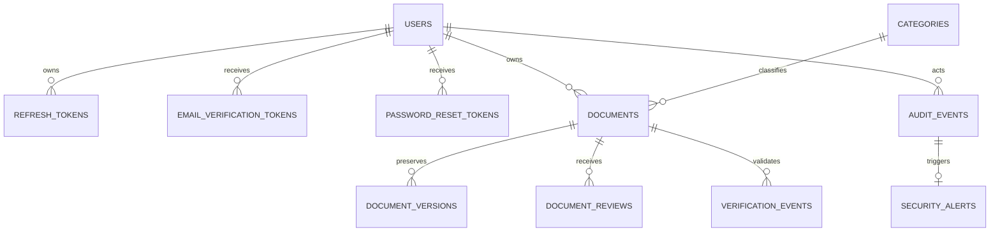

# Database Design

SecureDocs uses normalized PostgreSQL tables. The schema avoids duplicated document blobs and separates long-lived identity records, one-time tokens, document state, historical versions, review decisions, public verification events, audit records, and security alerts.

| Entity | Important design choices |
|---|---|
| `users` | Case-normalized unique email, bcrypt hash, role, verification state, last-login time, and lockout tracking. |
| `refresh_tokens` | Stores only a digest and token ID, allowing revocation and refresh-token rotation without storing raw credentials. |
| `documents` | Stores current metadata, private storage key, hash, status, immutable approved reference code, and ownership. |
| `document_versions` | Preserves prior file metadata and hash with a uniqueness constraint per document/version number. |
| `document_reviews` | Separates review decisions from the current status for a defensible approval history. |
| `verification_events` | Records both successful and unsuccessful public verification attempts without revealing a document's content. |
| `audit_events` | Append-only events include a hash chain (`previous_event_hash`, `event_hash`) for tamper-evident export and review. |
| `security_alerts` | Tracks unresolved suspicious events independently from the event log. |

## Constraints and indexes

Unique constraints cover user emails, current document storage keys, document reference codes, token digests, and document-version numbers. Indexes cover authorization and dashboard query paths such as document owner, category, status, reference code, user email, audit actor, audit event type, and verification reference code. The future Alembic migration will add database-level read-only controls for audit rows after insertion.
